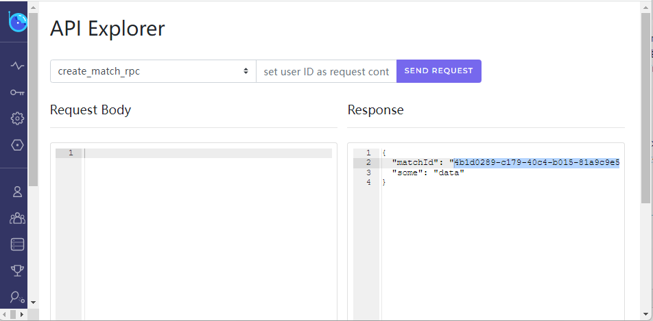
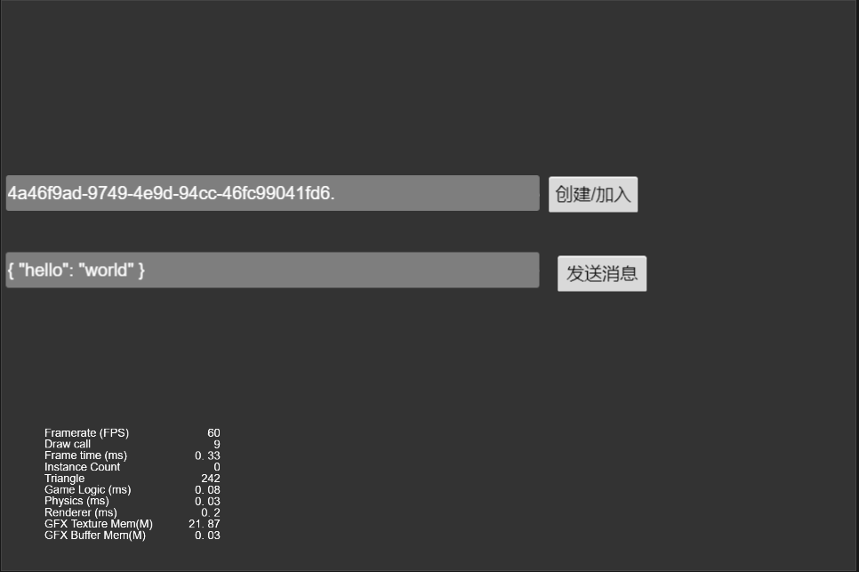

# nakama-go-demo
自定义nakama的扩展功能的demo，Authoritative Multiplayer（状态同步）的游戏

## 运行
```
docker compose up
```
会启动一个postgres数据库和一个nakama实例<br>
自定义扩展会通过Dockerfile自动生成到nakama的data/modules目录中<br>
客户端： https://github.com/0990/nakama_client_demo

## 自定义扩展
本项目包含2个rpc注册(healthcheck,create_match_rpc)和一个自定义游戏(LobbyMatch)<br>
通过调用create_match_rpc可创建一个LobbyMatch游戏

### 使用
http://localhost:7351/#/apiexplorer?endpoint=create_match_rpc

创建后生成的matchId填入客户端


## TODO 
* 游戏细节完善，弄一个mini小游戏


